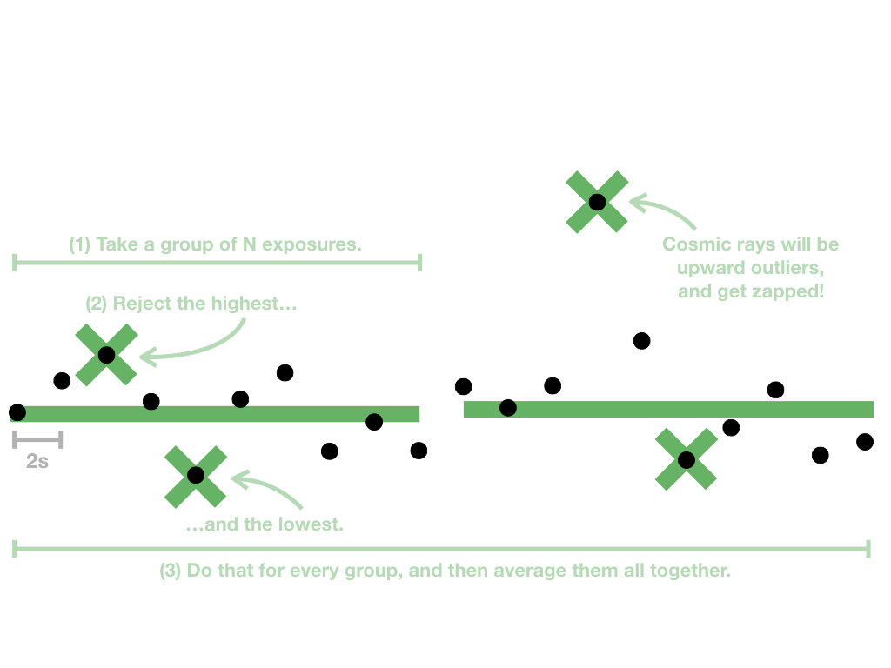

# zapcosmics

The [Transiting Exoplanet Survey Satellite (TESS)](https://heasarc.gsfc.nasa.gov/docs/tess/) will collect images at 2s cadence and stack these images into 120s postage stamps or 1800s full-frame images for downloading. A pixel-level cosmic ray mitigation algorithm will be applied to some of these image stacks. The algorithm is simple: the time series of flux values seen by a pixel is grouped into $N$ exposures, the highest and lowest values are rejected, and then the remaining values are averaged together. Here's the basic idea:

This pixel-level truncated mean has the potential to distort astrophysical signals that show very strong variations on very short timescales. This package contains code to simulate the effect of this algorithm on model light curves, so the cosmic ray mitigation process can be included (approximately) in your generative models.

### Installation

### Usage
