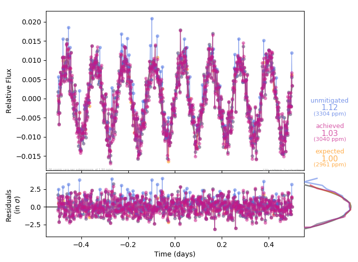

# tess-zap

The [Transiting Exoplanet Survey Satellite (TESS)](https://heasarc.gsfc.nasa.gov/docs/tess/) will collect images at 2s cadence and stack these images into 120s postage stamps or 1800s full-frame images for downloading. A pixel-level cosmic ray mitigation algorithm will be applied to some of these image stacks. The algorithm is simple: the time series of flux values seen by a pixel is grouped into N exposures, the highest and lowest values are rejected, and then the remaining values are averaged together. Here's the basic idea, shown for N=10:


This pixel-level truncated mean has the potential to distort astrophysical signals that show very strong variations on very short timescales. The `tess-zap` package contains code to simulate the effect of this algorithm on model light curves, so the cosmic ray mitigation process can be included (approximately) in your generative models. It zaps cosmic rays pretty well, but you might want to make sure it doesn't zap your particular astrophysical signal of interest.

### Installation

To install, this simplest way is probably simply to install it directly via `pip` from any UNIX prompt:
```
pip install tess-zap
```

If you want to be able to modify the code yourself, please also feel free to fork/clone this repository onto your own computer and install directly from that editable package.
```
git clone https://github.com/zkbt/tess-zap.git
cd tess-zap/
pip install -e .
```
This will link the installed version of the `tess-zap` package to your local repository. Changes you make to the code in the repository should be reflected in the version Python sees when it tries to `import tesszap`.

### Usage

Here's a basic example of how you can use `tesszap` to predict the effect of the TESS cosmic ray mitigation strategy on an arbitrary model light curve. The basic steps are:
+ define a model function of time (`wibblewobble`), and use it to create a light curve time series at TESS's 2-second data collection cadence.
+ choose a mitigation strategy (`Central(10)`) that is a truncated mean operating on groups of 10 exposures at a time, and apply it to the light curve.
+ make a plot that compares the light curve in which cosmics have been zapped (pink), the light curve if no cosmic-ray mitigation had been applied (blue), and the light curve if there hadn't been any cosmic rays in the first place (orange).


```python
from tesszap.tess import StampCadenceTimeseries
from tesszap.strategies import Central
import numpy as np

# Create a model (a function of time, in days).
def wibblewobble(t):
    amplitude, period = 0.01, 0.1234
    return amplitude*np.sin(2*np.pi*t/period)

# Create a light curve time series, generated from that model.
lc = StampCadenceTimeseries(tmag=12, model=wibblewobble)

# Create a stacking strategy object...
strategy = Central(10)
# ...and use it to zap the cosmic rays in the time series.
lc.stack(strategy)

# Print the noise with and without any mitigation strategy.
for k in lc.rms.keys():
    print('{:>20} noise is {:.3}'.format(k, lc.rms[k]))

# Show a plot of mitigated, unmitigated, and idealized light curves.
%matplotlib inline
lc.plot()
```

The output should look something like the following plot, which includes the light curves (top), the residuals from the model (bottom), and rotated histograms of the residuals (bottom right) on a log-scale.



Happy zapping!
